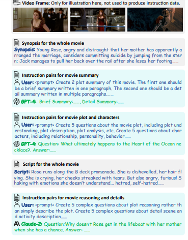

# Seeking the limitations of "LLaMA-VID: An Image is Worth 2 Tokens in Large Language Models"

### A. Tragoudaras, E.G. Lionis, O. Neut, T. Aslanidis, V. Karlis.

---

In this blog post, we discuss, reproduce, and extend the findings of the paper titled ["LLaMA-VID: An Image is Worth 2 Tokens in Large Language Models"](https://arxiv.org/abs/2311.17043). The authors introduce a Visual Language Model that aims to tackle the computational issue that arises with long video understanding and, more specifically, the excess of visual tokens needed for such videos.

The purpose of this blog post is:
-	To help researchers understand LLaMA-VID
-	To reproduce the results provided by the authors
-	Check the model’s performance in different datasets both in zero-shot and in fine-tuning context
---

## VLMs & LLaMA-VID:

With the rise in popularity of transformer-based LLMs [[11](#11)],  the performance gains for vision language models (VLMs) followed in a similar fashion. VLMs are a class of deep learning models combining visual and natural language aspects. Common tasks of these models consist of image captioning and visual question-answering (VQA). The existing multimodal models (LLaVA [[16](#16)], BLIP-2 [[3](#3)]) in this space have already proven to be quite good.  However, when considering video, these models are required to extrapolate from these single-image reasoning capabilities to reason about sequences of frames. Consequently, making it harder for these models to run inference since the input size is much more significant. Current VLMs represent an image with sizes from 32 tokens in BLIP-2 [[3](#3)] and up to 256 tokens in LLaVA [[16](#16)], making it impossible to process long videos. The LLaMA-VID model [[5](#5)] eliminates the issue posed by the scale of videos by representing an image with solely 2 tokens. Firstly, a context token that represents the image based on user input. Secondly, the content token represents the visual cues in the image. This 2 token approach has shown to be a more efficient approach while beating most of the video and image-based benchmarks.

## Related work:
Vision-language models are the product of advancements in both computer vision and natural language processing. The purpose of these models is to align both the natural language space and the vision space to enable cross-modality understanding and reasoning. Key advancements in this field have been marked by the inception of large-scale models like CLIP [[8](#8)]. These models have been trained using large-scale datasets of image-text pairs. After these models, the work in transformer-based language models like GPT and Llama has made significant advancements [[8](#8), [2](#2)]. Pushing the boundaries of LLMs even further has been accomplished by models like Vicuna, which perform fine-tuning on Llama with instruction pairs [[1](#1)]. Considering these leaps in LLMs, the performance of VLMs can be evidently increased by leveraging the LLM's power. This opportunity made space for well-known models like Flamingo [[22](#22)] and BLIP-2 [[3](#3)], which utilize both web-scale image-text pairs for their cross-modality alignment and LLMs. More modern versions have been proposed, such as LLaVA, a multi-modal model that uses an MLP to align the image and text space of LLaMA [[16](#16)].

Although the VLMs scale well on images, videos pose a new problem for multi-modality alignment. Videos contain many frames, and models like LLaVA or BLIP-2 require many tokens to represent them. Several popular frameworks have tackled this issue by introducing different unique solutions like Video-LLaMA [[9](#9)], VideoChat [[4](#4)], and Video-ChatGPT [[7](#7)]. The first two use BLIP-2 to extract video embeddings, while the latter uses spatial and temporal pooling in its mitigation effort. However, these VLMs still face difficulties handling long videos (> 1 hour), since the amount of tokens explodes in number. The current implementations are capped by a video length of 1 hour, making the use of long videos like movies not possible. This is where the novel 2-token approach from LLaMA-VID excels. The novel intuition of introducing a context token allows the model to condense the overall context of the image, based on the user query, into a single token. Meanwhile, the content token ought to capture the finer aspects of each frame. Notably, the LLaMA-VID model can be parametrized to generate multiple content tokens per frame depending on the resource constraints. 

## LLaMA-VID architecture:

As shown in [Figure 1](#Figure_1), LLaMA-VID consists of three main components: a visual encoder, a text decoder, and an LLM. In particular, for our experiments, the visual encoder used is the pre-trained EVA-G [[15](#15)], the text decoder is a QFormer-7b [[12](#12)], and the LLM is Vicuna-7B-v1.5 [[1](#1)]. Although the authors further experimented with QFormer-13b and Vicuna-13B-v1.5, we avoided this setup due to computational limitations.
The LLaMA-VID framework consists of the steps illustrated in [Figure 1](#Figure_1). To generate the context and content tokens, the model processes both the sequence of videos and the query provided by the user. There are two stages of computation: one for generating the context and one for content embeddings. As a first step during the context generation, the video sequence is passed through a vision transformer (ViT). Since this is a pre-trained model and serves as a backbone to the LLaMA-VID model, it is frozen during training. The visual embeddings generated by the vision transformer are given as input to the text decoder and the user-specified query, which outputs a text-guided query using the visual embedding. As a next step, a context attention block combines the query and the visual embedding, which is then projected down to the LLM latent space using a simple Feed-Forward Network, resulting in the context token. For content generation, the visual embedding created by the ViT encoder is projected similarly to the LLM latent space, and finally, the content token is constituted. As a last step, the content and context tokens are concatenated alongside the initial user question and given as input to the LLM.

<table align="center"> <tr align="center"> <td></td> </tr> <tr align="center"> <td colspan=2><b>Figure 1:</b> LLaMa-VID overall architecture.</td> </tr> </table>

### Vision and Text Encoder:
To prepare the model for achieving cross-modality alignment (See Section [modality alignment](https://github.com/taslanidis/LLama-VID/blob/main/blogpost.md#modality-alignmentl)), the frames of the video need to be encoded. The initial size of the frames is $\boldsymbol V_t \in \mathbb{R}^{H \times W \times 3}$. Then, a transformer-based visual encoder produces the visual embedding $\boldsymbol X_t \in \mathbb{R}^{N \times C}$ where the dimensions $N$ and $C$ denote the number of image patches and embedding channels, respectively. Finally, the visual embedding $\boldsymbol X_t$ is processed by the text decoder (either a QFormer or a BERT model) in combination with the user query to generate the text-guided query $Q_t \in \mathbb{R}^{M \times C}$. Note that $M$ denotes the number of queries.
​​
### Token generation:
The generation process of context and content tokens is intrinsic to the LLaMA-VID success in long-video understanding. These tokens form the input to the LLM at the end of the inference pipeline. The visual embedding produced by the visual encoder $\boldsymbol X_t$ and the text query $\boldsymbol Q_t$ are used to generate the tokens. At first, the context attention mechanism in the LLaMA-VID pipeline is used to aggregate text-related visual features into the context token $\boldsymbol E_t$.
$\boldsymbol{E}_t = \text{Mean}(\text{Softmax}(\boldsymbol{Q}_t \times \boldsymbol{X}_t^T) \times \boldsymbol{X}_t)$
This approach successfully captures the most crucial visual cues in the context token with the help of the text query. Secondly, the content token reaches its final state by performing adaptive pooling on the visual embedding $\boldsymbol X_t$. This adaptive pooling allows the content token $\boldsymbol E_t^V \in \mathbb{R}^{n \times C} \text{where } n \in [1, N]$ (where $N$ is the number of image patches from the vision encoder) to be of varying sizes, depending on the video length.
Subsequently, a linear projector module transforms the $\boldsymbol E_t^T$ and $\boldsymbol E_t^V$ to align with the LLM latent space. This entire video sequence is translated into tokens that the LLMs can interpret to generate an answer to the user query.

## LLaMA-VID training:
LLMs and VLMs require careful consideration during training, in order to scale. Instruction tuning is considered of greatest importance for LLMs [[1](#1), [17](#17), [11](#11)] and VLMs [[12](#12), [16](#16)].
The authors divide the training process into three steps. Each stage is described in the subsequent subsections.

### Modality Alignment
As a first step in the LLaMA_VID's architecture, the video must be aligned within the same latent space as the LLMs (see [Figure 1](#Figure_1)). In this stage, each video frame is transformed into the space of LLMs during a forward pass. In the architecture, the visual encoder and the text decoder are kept frozen, with their original pre-trained weights, to optimize the context attention and projectors. The model is trained on the LLaVA filtered dataset CC3M [[18](#18)] containing 558k image-captions pairs and the WebVid 2.5M [[19](#19)] dataset consisting of 232k video-caption pairs respectively (see [Figure 2](#Figure_2)).

### Instruction Tuning
We mentioned before that this part of training is crucial for allowing LLMs to develop multi-modal comprehension. For this reason, in this study, the authors adopt the strategy of Video-ChatGPT [[7](#7)] and LLaVA [[16](#16)] to build instruction pairs. The instruction pairs include different modalities (text, images, video), as depicted in [Figure 2](#Figure_2), while the input < prompt > answer < answer > prompts vary within the selected dataset. In the training procedure,  the image token < image > is appended at random, either at the beginning or at the ending of the user input. Note that during this stage, all models are allowed to update their parameters except for the visual encoder, which is kept frozen.

### Long Video Tuning
To further harness the potential of LLaMA-VID for long-hour videos, its creators build a dataset comprising 15,000 extended QA pairs, which includes 9,000 conversions from movie scenes and 6,000 samples derived from [[14](#14)] for token expansion. Over 400 feature-length films and their corresponding scripts from [[20](#20)] were used to develop the training set. The core components of the instruction generation process are illustrated in [Figure 3](#Figure_3).

The resulting dataset encompasses QA pairs across three dimensions: video summary, movie plot, and detailed reasoning. For video summaries, extracted movie synopses are utilized along with the use of advanced LLMs such as GPT-4  to produce both brief and extensive summaries for each film, resulting in approximately 1,000 summary-level instruction pairs. For plot-level data, the entire movie synopsis was used as input to GPT-4, which then generated plot-related and character-related QA pairs, including elements of plot comprehension, description, analysis, character relationships, personalities, and behaviors. Specifically, five plot-related pairs and five character-related pairs per movie were generated, respectively, yielding a total of 4,000 plot-level QA pairs. For detail-level data, the entire movie script is used as input into Claude-2 to generate five plot-related reasoning pairs and five detailed descriptions for each movie, culminating in another 4,000 pairs.

Utilizing these extended videos and the generated QA pairs, instruction tuning is carried out by concatenating visual and subtitle tokens for each frame, as depicted in [Figure 2](#Figure_2). This methodology allows LLaMA-VID to effectively manage 64,000 tokens, supporting over three hours of video input.

<table align="center">
  <tr align="center">
      <td></td>
  </tr>
  <tr align="center">
      <td></td>
  </tr>
  <tr align="center">
      <td></td>
  </tr>
    <td colspan=1><b>Figure 2.</b> < image -0> and < image-i > refer to the token for a single image and the i-th video frame, respectively</td>
  </tr>
</table>

<table align="center">
  <tr align="center">
      <td></td>
  </tr>
  <tr align="center">
    <td colspan=2><b>Figure 3:</b> Here is an example of instruction pairs for the movie Titanic. Using the movie synopsis and script, we employ advanced LLMs such as GPT-4 and Claude-2 to generate comprehensive movie summaries, plot-related QA pairs, and general reasoning QA pairs.</td>
  </tr>
</table>

### Experimental Setup
As we try to reproduce the results obtained from LLaMA-VID but also to conduct ablation studies, we have to introduce the models and metrics that we used during our experiment. 

In order to retrieve results that closely match the authors experiment for each benchmark, we stick our selection to the same backbone LLM ([Vicuna-7B-v1.5](https://huggingface.co/lmsys/vicuna-7b-v1.5) ), vision encoder ([EVA-ViT-G](https://storage.googleapis.com/sfr-vision-language-research/LAVIS/models/BLIP2/eva_vit_g.pth)), and text decoder ([QFormer-7b](https://storage.googleapis.com/sfr-vision-language-research/LAVIS/models/InstructBLIP/instruct_blip_vicuna7b_trimmed.pth))  as the ones used in LLaMA-VID. Note that we only test the 7B parameter model due to the memory footprint and computational restrictions.
The checkpoints utilized are [llama-vid-7b-full-336](https://huggingface.co/YanweiLi/llama-vid-7b-full-336) and [llama-vid-7b-full-224-video-fps-1](https://huggingface.co/YanweiLi/llama-vid-7b-full-224-video-fps-1), for images-only and videos experiments respectively.

An important metric for us is **accuracy**. Since accuracy is not a straightforward metric for language outputs, therefore we consider it necessary to present the way it is calculated. As we focus on question-answering tasks, the expected output of the LLaMA-vid is a text, dependent on the input video and question prompt. For each pair of input video/ prompt questions, a ground truth output( label or description) is also provided. To compare models' outputs' similarity with ground truth data, an LLM is utilized to answer “yes” or “no” and thus perform a typical classification task. Although in the context of the LLaMA-VID paper, a [GPT-3.5-Turbo](https://platform.openai.com/docs/models/gpt-3-5-turbo) model was used as the LLM evaluator, in the context of the reproducibility work and the ablation studies we use [Meta-Llama-3-8B-Instruct](https://huggingface.co/meta-llama/Meta-Llama-3-8B-Instruct) since the latter is open-sourced. 

### Reproducibility: LLaMA-VID
For the reproducibility of LLaMA-VID, we had to run inferences for several image-only and video benchmarks. We attempted to reproduce the results reported in the original LLaMA-VID paper and achieved similar outcomes with some minor differences. Overall, we can see from [Table 1](#Table_1) that we have almost the same results for the image-based benchmarks, with some cases even having a 1% increase. To validate the videos, we used a different QA expert, as mentioned in the Setup, instead of the API-based model that the authors use. Thus, we can see a discrepancy but the findings are still near the author's values. 

<table>
  <tr>
    <th>Benchmark type</th>
    <th>Benchmark name</th>
    <th>Authors' result</th>
    <th>Our result</th>
  </tr>
  <tr>
    <td>Image only</td>
    <td><a href="https://paperswithcode.com/dataset/gqa">GQA</a></
    td>
    <td>63.0</td>
    <td>64.38</td>
  </tr>
  <tr>
    <td>Image only</td>
    <td><a href="https://paperswithcode.com/dataset/mmbench">MMB</a>
    </td>
    <td>65.3</td>
    <td>65.63</td>
  </tr>
  <tr>
    <td>Image only</td>
    <td><a href="https://github.com/RUCAIBox/POPE">POPE</a></td>
    <td>86.6</td>
    <td>86.1</td>
  </tr>
  <tr>
    <td>Image only</td>
    <td><a href="https://paperswithcode.com/dataset/sqa">SQA-Image</a></td>
    <td>67.7</td>
    <td>68.22</td>
  </tr>
  <tr>
    <td>Image only</td>
    <td><a href="https://paperswithcode.com/dataset/vizwiz">VizWiz</a></td>
    <td>52.5</td>
    <td>55.18</td>
  </tr>
  <tr>
    <td>Image only</td>
    <td><a href="https://paperswithcode.com/sota/visual-question-answering-on-vqa-v2-test-dev">VQA v2</a></td>
    <td>78.3</td>
    <td>79.25</td>
  </tr>
  <tr>
    <td></td>
    <td></td>
    <td></td>
    <td></td>
  </tr>
  <tr>
    <td>Video</td>
    <td><a href="https://paperswithcode.com/sota/visual-question-answering-on-msvd-qa-1">MSVD-QA</a></td>
    <td>69.7</td>
    <td>59.17</td>
  </tr>
</table>

**Table 1: Benchmark Results Comparison**

The successful replication strengthens the validity of the original findings. It provides a solid foundation for further investigation into the model's ability to capture detailed information in complex video frames.

## Expected Limitations
In recent advancements in vision-language models, LLaMA-VID represents a significant leap forward by efficiently encoding video frames using only two tokens: a context token and a content token. This innovative approach balances the trade-off between computational efficiency and model performance, particularly for long video sequences. However, this token reduction strategy raises crucial questions about the model's expressiveness, especially in capturing fine-grained details within video frames.

Our primary motivation stems from the trade-off between model efficiency and the amount of tokens used to represent frames. By compressing each frame into just two tokens, LLaMA-VID reduces the available representational capacity per frame, potentially limiting the model's ability to capture intricate details. Detailed visual scenes, rich with subtle movements, small objects, and complex textures, often require a larger representation to preserve and convey the nuanced information effectively.

We are curious whether the model can capture various fine-graded details. One critical aspect is the model’s understanding of the real world, such as identifying animals or objects within a video. For example, what animals are in the video? Another detail involves more abstract comprehension, such as detecting actions or events on a video. For instance, can the model detect what action the animal does, or is there a crime in this video? 

Although the authors proposed a novel method for handling long video sequences, there is still room for improvement regarding the model's efficiency in handling its trainable weights. After carefully revising the implementation details of LLaMa-VID, we discovered that the authors had not considered the research direction of trading accuracy for achieving a lower memory footprint.  Recent advances in the field, like ow-Rank Adaptation (LoRA [[13](#13)]) optimize the trainability of LLMs by freezing the pre-trained model weights and then adding some trainable rank decomposition matrices into every layer of the Transformer architecture. The latter would significantly reduce the number of trainable parameters, allowing LLaMA-VID to be trained in GPUs with less VRAM.

## Extensions

To rigorously test our hypothesis, we propose evaluating LLaMA-VID on two new datasets specifically designed to assess its ability to capture fine-grained details. In particular, we have focused on video inputs and tested the provided model’s performance in question-answering tasks. Moreover, we wanted to understand what would happen if we increased the frames per second (FPS). In the provided paper, to evaluate these tasks, the authors utilize 'gpt-3.5-turbo' to evaluate the predictions made by the LLaMA-VID model. Since 'gpt-3.5-turbo'  is a closed model and we did not have access to an API key, we substituted it with Meta-Llama-3-8B-Instruct, one of the newest open-source LLMs released by Meta that has text-generation capabilities.

### Crime Dataset
Surveillance cameras are capturing a plethora of videos of daily activities at specific places.
Most of the videos captured contain realistic normal activities, but sometimes anomalies may
arise, such as illegal activities, a crime, or a traffic accident. These anomalous activities are
identified through fine-grained information in the videos, such as the color of a traffic light for
a specific moment, the item someone is holding in his hand, or an abrupt action such as a
punch or a kick.

Thus, such a dataset containing various surveillance videos provides us with an excellent
candidate to test the understanding and reasoning abilities of a vision language model. For
this, we will use the UCF Crime dataset by [[21](#21)]

The task for which we will perform inference demands the model to identify subtle and often
rapidly occurring actions indicative of criminal activity. As we described, anomalous activities
might span a very small amount of time in the video. Thus, we will do an ablation study to
show if, indeed, the model can’t identify what happened in the video, irrespective of the
number of frames per second. Having only one frame per second is something that could
easily be argued as the culprit of the model's loss of information on such activities.

Lastly, the type with which we will prompt the model to produce an answer plays a significant
role. In order to be able to use this dataset on our task, we had to create specific prompts
with MCQ, and the answers were to be the type of anomalous activity observed in the video.

However, it can be quite vague what an anomalous activity for our task is, so we finally
fine-tuned LLaMa-VID on the train set of the UCF dataset, consisting of both anomalous and
normal videos. Then, by conducting inference again, we show the performance improvement
of the models for such a task if they have been specifically trained to identify such specific
anomalous activities

### Animal Dataset
Understanding animals’ behaviors is significant for a wide range of applications. Animal dataset is a large and diverse dataset [[10](#10)] that provides multiple annotated tasks to enable a more thorough understanding of natural animal behaviors. It contains a diverse range of animals with 850 species and includes wild animal footage from different times of the day in an extensive range of environments. The provided videos come with output labels of different types, such as the different species captured in each video, their respective animal classes, and the different actions captured. This task necessitates capturing detailed visual features unique to each species. 
As this dataset contains several subtasks, we have focused on video data for the ‘grounding’ task. In this case, we manipulated output classes to perform inference and evaluation according to the LLaMA-VID pipeline. On top of that, we further manipulated the provided data so that we were also eligible to finetune our models by providing different types of conversational interactions. In particular, we had to convert existing data to specific prompts with MCQ, and the answers were the species of animals along with their classes and the actions they performed.

In total, we have created 3.5k Question-Answer (QA) Pairs for finetuning (one QA per video) and 812 QA pairs for evaluation. In the Table below, an example of the described pairs is provided. All instruction-tuning pairs are build folowing the strategy of Video-ChatGPT [[7](#7)].

### FPS hyperparameter tuning
The authors claim that a single content token can capture all essential information in an image, and one should increase the number of frames per second (FPS) to increase the performance of the model. To test this hypothesis, we utilized both Crime and Animal Datasets, which were introduced earlier, to fine-tune the model under two different conditions and ran inferences to get the corresponding accuracies.

1. First, we maintained the default settings FPS were set to 1. 
2. Second, we increased the FPS from 1 to 6. 

Through these experiments, we aim to verify the claim that a single content token is sufficient and to understand the effect of increasing FPS.

## Results:

#### Anomaly Detection 
Starting with our first ablation study and the experiments for the crime dataset, we validate the primary authors’ statements and further expand them. As expected, there is an evident improvement when tuning instructions. The most exciting outcome of this analysis, and our main contribution, is the positive impact of increasing FPS when performing instruction tuning. The decreased amount of content tokens, by compressing the visual embeddings per frame, allows us to experiment with a larger amount of frames. This is a promising result as it highlights that output metrics not only improve by models’ architecture but also by the formulation of input videos. In this context, finding an analytical method for selecting the optimal FPS number based on the input video’s characteristics would be interesting.

<table>
 <tr>
   <th>Crime</th>
   <th>Accuracy</th>
 </tr>
 <tr>
   <td>Zero-Shot \w FPS-1</td>
   <td>57.50%</td>
  </tr>
  <tr>
   <td>Zero-Shot \w FPS-6</td>
   <td>57.90%</td>
  </tr>
  <tr>
   <td>Finetuned predictions FPS-1</td>
   <td>62%</td>
  </tr>
  <tr>
   <td>Finetuned predictions FPS-6</td>
   <td>65.30%</td>
  </tr>
</table>

**TABLE 2: Aggregated results for Crime Dataset**

Calculating the overall accuracies can be found in [Table 2](#Table_2) below.

Increasing FPS on zero-shot without finetuning doesn’t result in big improvements. However, increasing the FPS while fine-tuning shows greater capabilities. 

As the authors claim, the plethora of content tokens, by compressing them into a single one, maintains good enough information for a fine-grained anomaly detection task and consequently allows us to increase the frames per second. For surveillance videos, it is rather important to use a higher FPS since activity can go down really quickly, and we are interested in fine-grained information in the temporal space.

<table align="center">
  <tr align="center">
      <td></td>
      <td></td>
  </tr>
  <tr align="center">
    <td colspan=2><b>Figure 4:</b> Confusion matrix for Zero Shot 1 FPS</td>
  </tr>
</table>

In the box solution, the author's results for anomaly detection are poor, showcasing that even though the model is performing fairly on a binary classification – anomaly or no-anomaly, it is biased towards predicting anomalies as “abuse” or “road accident”.

In a fine-tuned setting, with an increased FPS to 6, we are identifying a great boost in the performance, more importantly across anomaly categories [Figure 5](#Figure_5).

<table align="center">
  <tr align="center">
      <td></td>
      <td></td>
  </tr>
  <tr align="center">
    <td colspan=2><b>Figure 5:</b> Confusion matrix for finetuned 6 FPS</td>
  </tr>
</table>

More importantly, it is crucial to investigate the accuracies per class for each model setting, presented in [Table 3](#Table_3) and [Figure 6](#Figure_6).

<table>
 <tr>
   <th>Crime</th>
   <th>Zero-Shot \w FPS-1</th>
   <th>Zero-Shot \w FPS-6</th>
   <th>Finetuned \w FPS-1</th>
   <th>Finetuned \w FPS-6</th>
  
 </tr>
 <tr>
   <td>Abuse</td>
   <td>50%</td>
   <td>50%</td>
   <td>0%</td>
   <td>0%</td>
 </tr>
  <tr>
   <td>Arrest</td>
   <td>0%</td>
   <td>0%</td>
   <td>0%</td>
   <td>0%</td>
 </tr>
 <tr>
   <td>Arson</td>
   <td>43%</td>
   <td>43%</td>
   <td>33%</td>
   <td>56%</td>
 </tr>
 <tr>
   <td>Assault</td>
   <td>0%</td>
   <td>0%</td>
   <td>50%</td>
   <td>100%</td>
 </tr>
 <tr>
   <td>Bulgary</td>
   <td>10%</td>
   <td>10%</td>
   <td>60%</td>
   <td>80%</td>
 </tr>
 <tr>
   <td>Explosion</td>
   <td>14%</td>
   <td>14%</td>
   <td>40%</td>
   <td>35%</td>
 </tr>
 <tr>
   <td>Fighting</td>
   <td>25%</td>
   <td>25%</td>
   <td>0%</td>
   <td>20%</td>
 </tr>
 <tr>
   <td>Normal Video</td>
   <td>73%</td>
   <td>74%</td>
   <td>79%</td>
   <td>80%</td>
 </tr>
 <tr>
   <td>Road Accident</td>
   <td>91%</td>
   <td>91%</td>
   <td>83%</td>
   <td>87%</td>
 </tr>
 <tr>
   <td>Robbery</td>
   <td>20%</td>
   <td>20%</td>
   <td>60%</td>
   <td>60%</td>
 </tr>
 <tr>
   <td>Shooting</td>
   <td>0%</td>
   <td>0%</td>
   <td>0%</td>
   <td>0%</td>
 </tr>
</table>

**Table 3: Categorized results for Crime Dataset**

<table align="center">
  <tr align="center">
      <td></td>
  </tr>
  <tr align="center">
    <td colspan=2><b>Figure 6:</b> Accuracies per crime per method.</td>
  </tr>
</table>

As for the second ablation study, as can be seen in Table 2, we showcase the significance of instruction-tuning when performing inference in unexplored fine-grained datasets. 

#### Animals Dataset

Similarly, in [Table 4](#Table_4), we demonstrate the effect of fine-tuning for the animal dataset. Specifically, the accuracy doubled with re-training/fine-tuning on almost 3.5k data points (QA pairs). The accuracy column refers to a binary decision made by the [Llama-3-8B-Instruct](https://huggingface.co/meta-llama/Meta-Llama-3-8B-Instruct) used for evaluating the predictions made by the LLaMA-VID model. Specifically, given a video and its QA pairs (A: ground-truth), the **Llama-3-8B-Instruct** utilizes its text-generation capabilities for deciding if the predictions of LLaMA-VID capture the same events annotated in the ground truth answer. Also, a score between zero and five is provided, with zero classifying the prediction as entirely irrelevant and five as completely relevant.
(Comment about the fine-tuning effect with increased FPS still in the making)

<table>
 <tr>
   <th>Inference context</th>
   <th>Accuracy</th>
   <th>Average score</th>
  
 </tr>
 <tr>
   <td>Zero-Shot \w FPS-1</td>
   <td>18.04%</td>
   <td>1.32</td>
  
 </tr>
 <tr>
   <td>Zero-Shot \w FPS-6</td>
   <td>19.50%</td>
   <td>1.34</td>
  
 </tr>
 <tr>
   <td>Finetuned \w FPS-1</td>
   <td>34.06%</td>
   <td>2.65</td>
  
 </tr>
 <tr>
   <td>Finetuned \w FPS-6</td>
   <td>34,89%</td>
   <td>2.66</td>
  
 </tr>
 </table>

**Table 4: Results for Animal Dataset**

#### Error Analysis

After finetuning, the LLaMA-VID still generates inaccurate predictions for a video and question/answer pair (ground-truth answer provided in the dataset). However, there are many cases where finetuning mitigated the completely irrelevant predictions. Table 5 demonstrates an example where the LLaMA-VID model completely hallucinates when prompted in a zero-shot fashion. After training on the instruction-tuning pairs we have created, one can observe that LLaMA-VID prediction has improved significantly and is much more relevant.
 

<table>

<tr>
<th>Inference context</th>
<th>Question</th>
<th>True Label</th>
<th>Prediction Label</th>
<th>Relevance</th>
<th>Relevance Score</th>
</tr>
<tr>
  <td>Zero-Shot /w FPS1</td>
   <td>Find the action each animal performs in the video. Provide independent sentences for each animal and their corresponding action in the video. Do not repeat sentences. Pay careful attention, as some videos only have a single animal through the video.</td>
   <td>The tit bird is shaking its head. The tit bird is preening itself. The tit bird is sensing its environment. The tit bird is chirping.</td>
  <td>The bird perches on a branch and sings, while the squirrel climbs a tree and the bird sits on a branch.</td>
  <td>no</td>
  <td>0</td>
 </tr>
  <tr>
  <td>Finetuned /w FPS1</td>
   <td>Find the action each animal performs in the video. Provide independent sentences for each animal and their corresponding action in the video. Do not repeat sentences. Pay careful attention, as some videos only have a single animal through the video.</td>
   <td>The tit bird is shaking its head. The tit bird is preening itself. The tit bird is sensing its environment. The tit bird is chirping.</td>
  <td>The tit bird is sensing its environment. The tit bird is chirping.</td>
  <td>yes</td>
  <td>4</td>
 </tr>
</tr>
 </table>

**Table 5: Error analysis on Animal Dataset predictions**

#### Training Curves
[Figure 7](#Figure_7) illustrates the training curve during finetuning the LLaMA-VID model on the two new dataset with specialy designed instruction tuning pairs as in [[16](#16), [4](#4)].

<table align="center">
  <tr align="center">
      <td></td>
  </tr>
  <tr align="center">
    <td colspan=2><b>Figure 7:</b> Accuracies per crime per method.</td>
  </tr>
</table>

## Further Research Questions
Since the evaluation of the prediction of the LLaMA-VID is based on an LLM expert and its next-generation capabilities for the Video QA task, as described in Section [Results of animal dataset](#Animals_Dataset), the task prompts used during inference influence the relevance prediction. In future work, we would like to experiment with different task prompts and also use recent API-based closed models, such as the most recent [GPT-4o](https://platform.openai.com/docs/models/gpt-4o).

## Conclusion:

Compressing visual embeddings as content tokens to smaller sizes allows experimentation with the number of frames used. In many cases of long videos such as movies, a low granularity of frames is good enough for the model to understand the plot. However, we show that a higher frame granularity is essential for tasks where fine-grained information in the temporal space is crucial, such as anomaly detection or activity recognition. To support the primary author's contribution, compressing the visual embeddings does not discard essential information and simultaneously allows the experiment to be conducted with a higher number of frames per second of video, which is critical for various tasks.

## Author's contributions:

- Antonis: Initial setup of the codebase, built the environment in the cluster, and executed the inferences for image and video benchmarks. Created scripts for evaluating the zero-shot performance of LLaMA-VId on Crime and animal-kingdom datasets respectively. Further fine-tuning LLaMA-VID on these two new datasets.
- Vasilis: Literature review to spot weaknesses of LLaMA-VID, ablation study to explore details in videos, investigation and selection of animal-kingdom dataset. Pre-processing of the dataset, data-pipeline set-up and implementation of the respective inference and fine-tuning tasks. Helped with blogpost and literature study
- Fanis: Identification of anomaly detection dataset. Ablation study to explore missing detail information. Data pipeline setup for a new dataset. Finetuning on a new dataset. Reviewing literature and related work for potential short-comings of the paper, and VLMs in general.
- Emmanouil: Helping in the initial setup of the codebase and the execution of inferences for images and video benchmarks. Understanding how the fine-tuning is executable and how to set it up. Helping preprocess the dataset and setting up the fine-tuning execution for the Animal Kingdom dataset. Set up the repository and the README file, helped with the blogpost and the poster.
- Oliver: Helping with getting the results for the reproducibility study. Setup of initial spike concerning zero-shot evaluation on new dataset. Literature study on VLMs. Writing and creating the structure of the blogpost.

## Bibliography:

<a id="1">[1]</a>  Wei-Lin Chiang, Zhuohan Li, Zi Lin, Ying Sheng, Zhanghao Wu, Hao Zhang, Lianmin Zheng, Siyuan Zhuang, Yonghao Zhuang, Joseph E. Gon- zalez, Ion Stoica, and Eric P. Xing. Vicuna: An open-source chat- bot impressing gpt-4 with 90%* chatgpt quality, March 2023. URL https://lmsys.org/blog/2023-03-30-vicuna/. 

<a id="2">[2]</a>  Chao Jia, Yinfei Yang, Ye Xia, Yi-Ting Chen, Zarana Parekh, Hieu Pham, Quoc Le, Yun-Hsuan Sung, Zhen Li, and Tom Duerig. Scaling up visual and vision- language representation learning with noisy text supervision. In International conference on machine learning, pages 4904–4916. PMLR, 2021. 

<a id="3">[3]</a> Junnan Li, Dongxu Li, Silvio Savarese, and Steven Hoi. Blip-2: Bootstrapping language-image pre-training with frozen image encoders and large language models. In International conference on machine learning, pages 19730–19742. PMLR, 2023a. 

<a id="4">[4]</a> KunChang Li, Yinan He, Yi Wang, Yizhuo Li, Wenhai Wang, Ping Luo, Yali Wang, Limin Wang, and Yu Qiao. Videochat: Chat-centric video understand- ing. arXiv preprint arXiv:2305.06355, 2023b. 

<a id="5">[5]</a> Yanwei Li, Chengyao Wang, and Jiaya Jia. Llama-vid: An image is worth 2 tokens in large language models, 2023c. 

<a id="6">[6]</a> Ruipu Luo, Ziwang Zhao, Min Yang, Junwei Dong, Minghui Qiu, Pengcheng Lu, Tao Wang, and Zhongyu Wei. Valley: Video assistant with large language model enhanced ability. arXiv preprint arXiv:2306.07207, 2023. 

<a id="7">[7]</a> Muhammad Maaz, Hanoona Rasheed, Salman Khan, and Fahad Shahbaz Khan. Video-chatgpt: Towards detailed video understanding via large vision and language models. arXiv preprint arXiv:2306.05424, 2023. 

<a id="8">[8]</a> Alec Radford, Jong Wook Kim, Chris Hallacy, Aditya Ramesh, Gabriel Goh, Sandhini Agarwal, Girish Sastry, Amanda Askell, Pamela Mishkin, Jack Clark, et al. Learning transferable visual models from natural language su- pervision. In International conference on machine learning, pages 8748–8763. PMLR, 2021. 

<a id="9">[9]</a> Hang Zhang, Xin Li, and Lidong Bing. Video-llama: An instruction- tuned audio-visual language model for video understanding. arXiv preprint arXiv:2306.02858, 2023. 

<a id="10">[10]</a> Ng, Xun Long, et al. "Animal kingdom: A large and diverse dataset for animal behavior understanding." Proceedings of the IEEE/CVF Conference on Computer Vision and Pattern Recognition. 2022. 

<a id="11">[11]</a> Hugo Touvron, Thibaut Lavril, Gautier Izacard, Xavier Martinet, Marie-Anne Lachaux, Timoth ́ee Lacroix, Baptiste Rozi`ere, Naman Goyal, Eric Hambro, Faisal Azhar, et al. Llama: Open and efficient foundation language models (2023). arXiv preprint arXiv:2302.13971, 2023. 

<a id="12">[12]</a> Wenliang Dai, Junnan Li, Dongxu Li, Anthony Meng Huat Tiong, Junqi Zhao, Weisheng Wang, Boyang Li, Pascale N Fung, and Steven Hoi. Instructblip: Towards general-purpose vision-language models with instruction tuning. Advances in Neural Information Processing Systems, 36, 2024. 

<a id="13">[13]</a> Hu, Edward J., et al. "Lora: Low-rank adaptation of large language models." arXiv preprint arXiv:2106.09685 (2021). 

<a id="14">[14]</a> Sultani, Waqas, Chen Chen, and Mubarak Shah. "Real-world anomaly detection in surveillance videos." Proceedings of the IEEE conference on computer vision and pattern recognition. 2018. 

<a id="15">[15]</a> Sultani, Waqas, Chen Chen, and Mubarak Shah. "Real-world anomaly detection in surveillance videos." Proceedings of the IEEE conference on computer vision and pattern recognition. 2018.

<a id="16">[16]</a> Haotian Liu, Chunyuan Li, Yuheng Li, and Yong Jae Lee. Improved baselines with visual instruction tuning. arXiv:2310.03744, 2023.

<a id="17">[17]</a> Rohan Taori, Ishaan Gulrajani, Tianyi Zhang, Yann Dubois, Xuechen Li, Carlos Guestrin, Percy Liang, and Tatsunori B. Hashimoto. Stanford alpaca: An instruction-following llama model. https://github.com/tatsu-lab/stanford_alpaca, 2023.

<a id="18">[18]</a>  Piyush Sharma, Nan Ding, Sebastian Goodman, and Radu Soricut. Conceptual captions: A cleaned, hypernymed, image alt-text dataset for automatic image captioning. In ACL, 2018.

<a id="19">[19]</a> Max Bain, Arsha Nagrani, Gul Varol, and Andrew Zisserman. Frozen in time: A joint video and image encoder for end-to-end retrieval. In ICCV, 2021.

<a id="20">[20]</a> Qingqiu Huang, Yu Xiong, Anyi Rao, Jiaze Wang, and Dahua Lin. Movienet: A holistic dataset for movie understanding. In ECCV, 2020

<a id="21">[21]</a> Sultani, Waqas, Chen Chen, and Mubarak Shah. "Real-world anomaly detection in surveillance videos." Proceedings of the IEEE conference on computer vision and pattern recognition. 2018

<a id="22">[22]</a> Jean-Baptiste Alayrac, Jeff Donahue, Pauline Luc, Antoine Miech, Iain Barr, Yana Hasson, Karel Lenc, Arthur Mensch, Katherine Millican, Malcolm Reynolds, et al. Flamingo: a visual language model for few-shot learning. Advances in neural information processing systems, 35:23716–23736, 2022.

